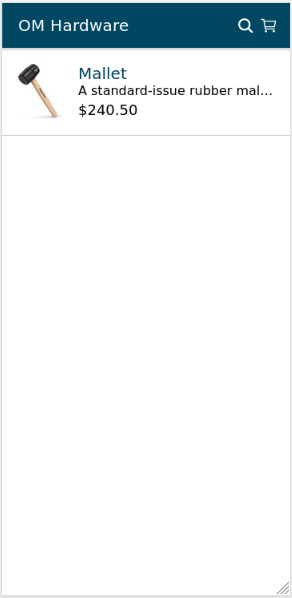
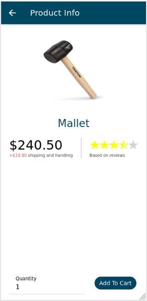
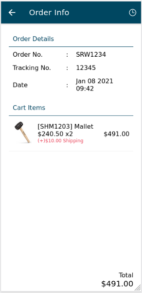
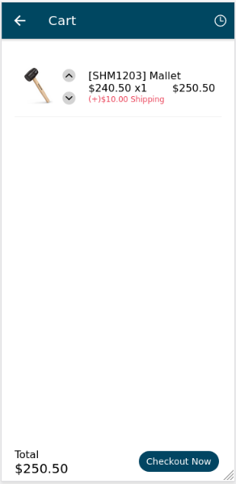

<h1>React App</h1>

Corresponding Backend: <a href="https://github.com/otboss/react-app-backend">https://github.com/otboss/react-app-backend</a>

A sample react app. This app simply showcases a concept of the frontend for the abovementioned backend. Some expected features may be unavailable. Key tools used are:

<ul>
  <li>
    
<a href="https://www.npmjs.com/package/react-image">React Image</a>

  </li>
  <li>
    
<a href="https://www.npmjs.com/package/react-redux">Redux</a>

  </li>
  <li>
    
<a href="https://www.npmjs.com/package/@ionic/cli">Ionic</a>

  </li>
</ul>

<h3>Screenshots</h3>
 

  
  
  
  

 
<h3>Getting Started</h3>
<ol>
  <li>
    Install dependencies
    <pre>npm install</pre>
  </li>
  <li>
    Run App
    <pre>npm run start</pre>
  </li>
</ol>
<h3>Testing</h3>
<ol>
  <li>
    Run the unit tests with:
    <pre>npm run test</pre>
  </li>
  <li>
    Run integration and end-to-end tests to see the app in action with:
    <pre>npm run e2e-gui</pre>
  </li>
</ol>
